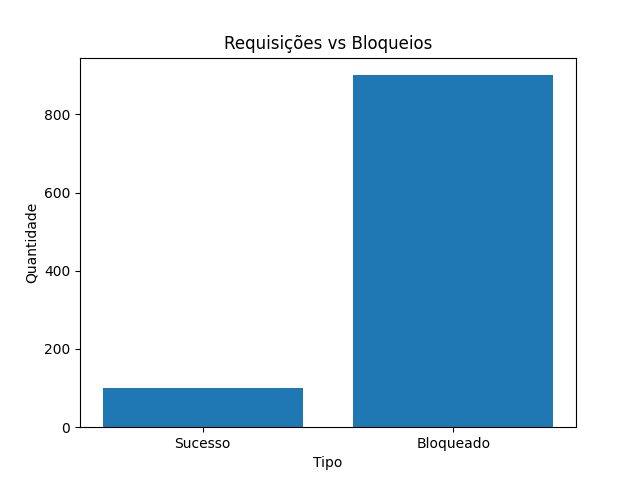

# 🛡️ DDoS Defense Lab

Simulador de ataque de alta carga com mecanismo de defesa baseado em rate limiting.

---

## 📊 Preview



---

## 🚀 Sobre o projeto

Este projeto simula um cenário real de sobrecarga em APIs, onde múltiplas requisições simultâneas são disparadas contra um servidor para testar sua resiliência.

O sistema implementa um mecanismo de defesa baseado em **rate limiting por IP**, bloqueando automaticamente tráfego abusivo.

---

## 🧠 Arquitetura do sistema

```
Attacker Script  --->  API (FastAPI)  --->  Rate Limiter  --->  Response
                         │
                         └── Monitoramento (CPU, RAM, Requests)
```

### Componentes:

* **API (FastAPI):** simula um serviço real
* **Rate Limiter:** controla requisições por IP
* **Attacker:** gera carga simultânea
* **Monitor:** coleta métricas do sistema

---

## 🔐 Conceitos de segurança

* Rate Limiting
* Proteção contra DoS
* Controle de tráfego por IP
* Simulação de carga massiva
* Monitoramento de recursos

---

## 💻 Execução

### 1. Instalar dependências

```bash
pip install -r requirements.txt
```

### 2. Subir o servidor

```bash
python -m uvicorn server.app:app --reload
```

### 3. Simular ataque

```bash
python attacker/load_test.py
```

### 4. Monitoramento

```bash
python monitor/metrics.py
```

---

## 📊 Resultado do teste

O gráfico abaixo mostra o comportamento do sistema sob carga:

* Aumento abrupto de requisições
* Ativação do rate limiting
* Estabilização do servidor


---

## 💼 Aplicação real

Este projeto demonstra na prática como sistemas modernos podem:

* Prevenir ataques de negação de serviço (DoS)
* Proteger APIs públicas
* Garantir estabilidade sob alta carga
* Implementar mecanismos de defesa escaláveis

---

## ⚠️ Aviso

Projeto para fins educacionais.

⚠️ Execute apenas em ambiente controlado (localhost)
