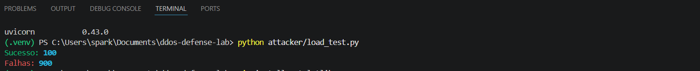

# 🛡️ DDoS Defense Lab

Simulador de ataque de alta carga com mecanismo de defesa baseado em rate limiting.

---

## 📊 Preview do sistema


---

## 🚀 Sobre o projeto

Este projeto simula um cenário real de sobrecarga em APIs, onde múltiplas requisições são enviadas simultaneamente para testar a resistência do servidor.

O sistema implementa um mecanismo de defesa que identifica e bloqueia excesso de requisições por IP.

---

## 🧠 Como funciona

1. Um servidor com FastAPI simula uma API real
2. Um sistema de rate limiting controla o número de requisições
3. Um script envia múltiplas requisições simultâneas
4. O sistema bloqueia automaticamente tráfego excessivo
5. Os resultados são analisados e exibidos em gráfico

---

## 🔐 Conceitos de segurança aplicados

* Rate Limiting
* Proteção contra DoS
* Controle de tráfego por IP
* Simulação de ataque de alta carga
* Monitoramento de recursos

---

## 📊 Resultado


---

## 💻 Execução do ataque



---

## ⚙️ Tecnologias utilizadas

* Python
* FastAPI
* httpx
* psutil
* matplotlib

---

## ▶️ Como rodar o projeto

```bash
pip install -r requirements.txt
python -m uvicorn server.app:app --reload
```

Em outro terminal:

```bash
python attacker/load_test.py
```

Monitoramento:

```bash
python monitor/metrics.py
```

---

## 💼 Aplicação real

Este projeto demonstra como sistemas podem se proteger contra sobrecarga de requisições, simulando cenários reais de ataques de negação de serviço (DoS).

---

## ⚠️ Aviso

Este projeto é para fins educacionais.
Executar apenas em ambiente controlado (localhost).
